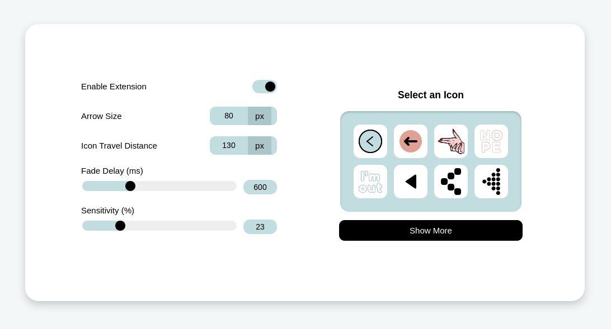
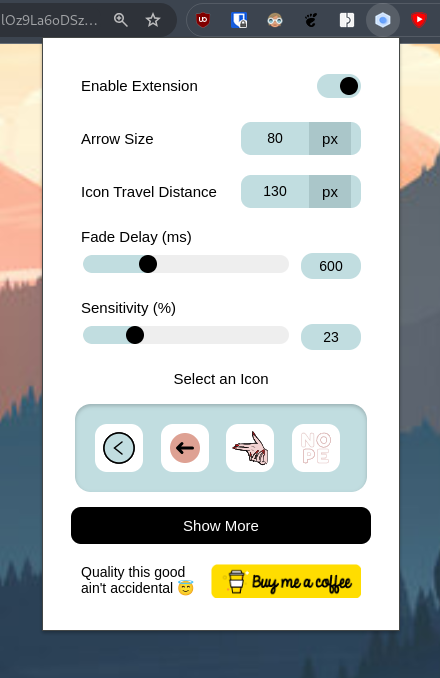

  

<ul style="list-style: none">
<h2>Swipe Navigation Gesture Extension</h2>
</ul>

  
  
  

 

---

<ul style="list-style: none">
<h2> This wasn’t just a problem—it was a taunt.  And I don’t take taunts lightly.</h2>
</ul>

This extension is especially for people using Chrome on Linux whose "back/forward two-finger swipe navigation gesture" does not work. God that's a long thing to say

I love how it turned out though. Personally, I feel it's better than the native (obviously) and much more fun to use.

Spent a lot of time trying to build Gnome extension only to find Gnome only captures touchdown and touchup events from two-finger gestures. Swipe gestures (as scroll events) are handled by the app itself. Downloaded available Chrome extensions, but they were half baked and buggy. After a long week of programming in languages I didn't want to, built something far more polished and reliable.

# Features:
 1. Swipe back forth to navigate
 2. Quick on/off toggle button
 3. Customizability
    1. Arrow Size
    2. Sensitivity
    3. Arrow Fade Delay  
    4. Icon Travel Distance
    5. Select Custom Arrow Style
 4. **Upcoming** (if enough traction):
    1. Pull down to refresh (as in phones)
    2. Pinch to zoom
    3. Upload custom svg feat
    4. Certainly more icon styles

# Loving it? Let me know!

 
<h4>Leave a review on webstore!</h4>
  
  
<h4>A supporter is worth a 100 followers!</h4>
  
 

# Not Loving it?

Create an [issue](https://github.com/44yu5h/chrome-swipe-nav-ext/issues) and abuse in the dm\
Same goes for feature requests except for the abuse part.
 

# Contribute

Fork the repo, clone it, make changes, [test locally on Chrome](https://dev.to/ben/how-to-install-chrome-extensions-manually-from-github-1612), create an issue, and then submit a PR. Easy?

Please contribute to the repository to keep it updated and functional, unlike other unmaintained extensions.\
Be sure to **fork** the repository **rather than** downloading the ZIP file to make changes, so you can relay your changes later if need be.

# Screenshots

  
 &nbsp;&nbsp;&nbsp;&nbsp;&nbsp;

# Info

Won't work on "New Tab" or any other Chrome-specific pages due to security restrictions. That’s just how all extensions work—don’t blame me\
Settings auto-save when changed. Refresh page to reflect changes

Credits for initial base goes to @[golopot](https://github.com/golopot/swipe-back)\
Taking over since it is not maintained anymore and has bugs.